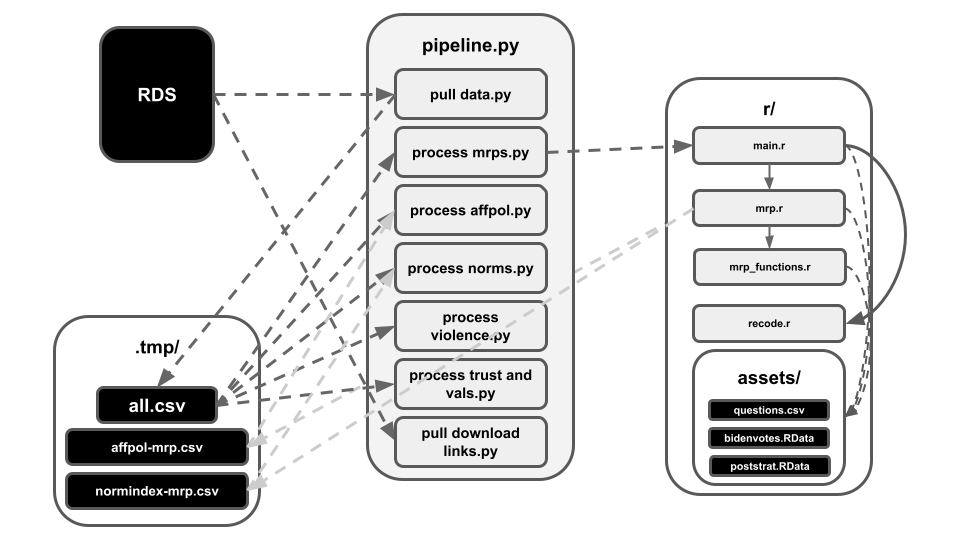

This folder contains a collection of scripts that pull+process data _from_ our primary relational database _to_ the dashboard. Here's what everything does:

- `utils.py`: a bunch of useful functions that are frequently reused
- `pull data.py`: gets all the survey data from our database; saved to `.tmp/all.csv`
- `process mrps.py`: calls the scripts in the `r/` folder to generate the affective polarization and democratic norms index maps. Then it sends the results upwards.
- `process affpol data.py`: processes all the affective polarization data from `.tmp/` and sends the results upwards.
- `process norms.py`: processes all the data regarding support for democratic norm violations from `.tmp/` and sends the results upwards.
- `process violence.py`: processes all the data regarding support for political violence from `.tmp/` and sends the results upwards.
- `process trust and values.py`: processes all the data regarding political trust and values from `.tmp/` and sends the results upwards.
- `pull download links.py`: pulls the download links from our relational database and saves the results in `../_data/`; this is what's used by the `downloads` tab
- `pipeline.py`: runs all these scripts ^ in order

# Notes

These scripts rely on some things that we keep internally that aren't currently shared with the public; for instance:

- An ini file with our database credentials (this isn't shared for obvious reasons)
- An internal sqlalchemy wrapper class that makes life easier on our data scientist (this isn't something we're intentially keeping secret; eventually this will be a public submodule. it just currently isn't)

Because of that, this won't be something you'd be able to run on your own (unless you work for the lab and have access to those internal files). However, we figured we'd throw the build scripts in this git repo anyways for the sake of full transparency.

